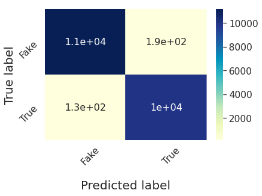
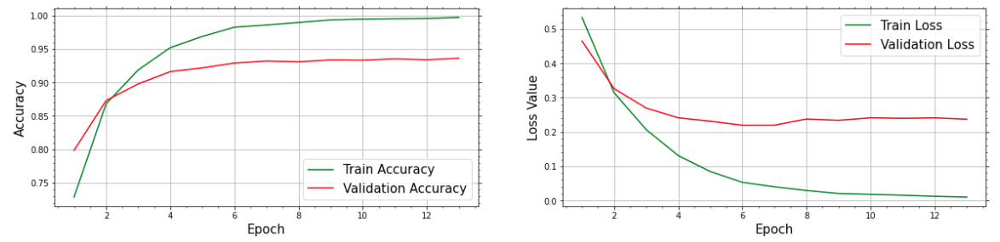

# Project Skyhawk
A deep convolutional network implementation for Deepfake detection. 
Ayan Mitra, 2020  

The goal of this proect is to build a pipeline for detecting whether a  given video, is a real or fake video. 

## Deep Fakes Detection
This repository contains the souce code for classifying videos whether they are Deepfakes or not. Deepfake algorithms can create fake images and videos that humans can't detect from the authentic one. Generation of Deepfakes has begun to erode people's trust in media and question on their reliability and unbiasedness. Therefore the accurate identification of Deepfake videos via the establishement of robust pipeline is going to be necessary at present. 

 Deep learning algorithms in recent years have been comprehensively used to solve various complex problems. It is also showing promising results in terms of Deepfake detection.  Various established deep learning based architectures are successfully used for Deepfake detections as well as coninuous ongoing researches are developing better algorithms.  

 

## Algorithm
Our algorithm for Deepfake detection is a deep convolutional network based on the state of the art    <a href="https://arxiv.org/pdf/1602.07261.pdf">Inception Resnet V2</a> architecture.    This stems from the family of Inception deep convolutional architecture originally called as the <a href="https://arxiv.org/abs/1409.4842">GoogLeNet</a>.  Res Net : Residual Network with Stochastic Gradient Descent. It is trained on more than a million images from the ImageNet database. The network is 164 layers deep with  56𝑀  parameters and can classify images into 1000 object categories. As a result, the network has learned rich feature representations for a wide range of images. We use pretrained 'imagenet' for weights initialization while keeping the training option on i.e. trainable=True. 

Our classification is based on frame by frames approach from a given video. We train our neural network on the frames from the videos labelled as 'fake' and 'real' and then generate a model which can be used to identify new videos as fake or real. 
We used open CV2 for extracting frames from the videos and then used the dlib library to detect faces in them. 

## Data Set

To train our classifier, we made use of '.mp4' videos, seperated into binary labels : [Fake, Real]. There were 200 videos of each label.  Length of videos vary roughly between few seconds to 2 minutes and file sizes on an averge are <20 MB but  files as big as 110 MB were also used.  

##  Hyperparameters   
Pooling      : Global Average Pooling 
Acitvation : Softmax 
Optimizer : Adam 
Batch Size : 80  
Accuracy   : 99.7\%() for Training to terminate 

## Performance

 Accuracy \% = 98.5 () 
True positive = 11157 , (51.87)\%  
False positive = 192 , (0.89)\%  
False negative = 130 , (0.60)\%  
True negative = 10031 , (46.63)\%

 

The accuracy and Loss of the train and test sets are plotted below. 

 
We see that there is a tendency for the validation set to ovefit as can be seen from the Loss function plot. We speculate further future improvement on the model can be made, by fine tunning the hyperparameters. This includes attention to reducing the overfitting tendency (though this is not highly pronounced, but can be improved). Adding suitable 'dropout' layer could assist in this condition, aditionally the learning rate of the 'Adam' optimizer can be further scrutinized by adding decay parameter.  
